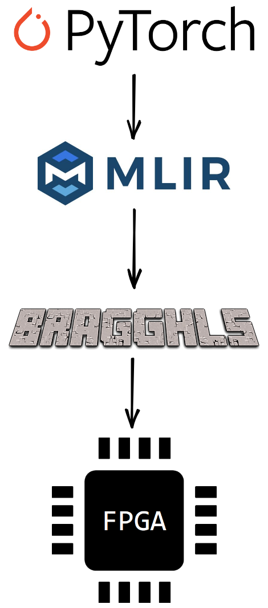
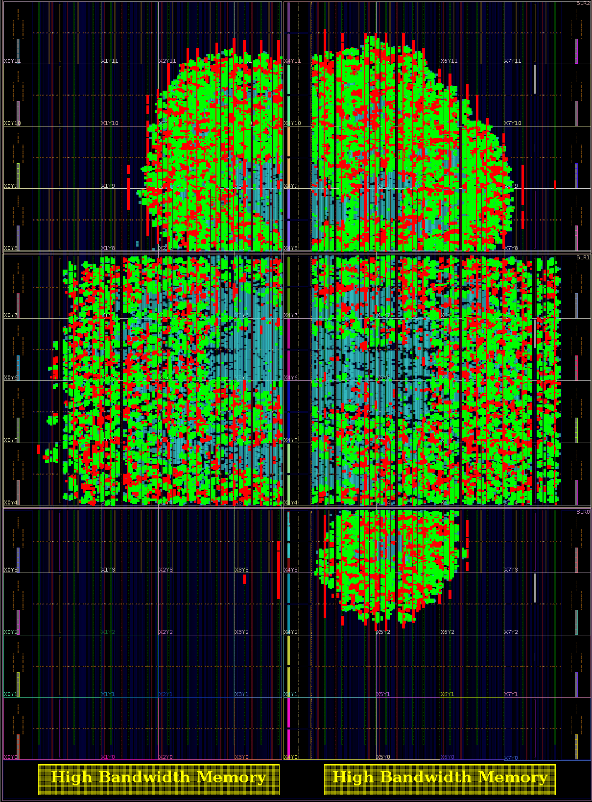
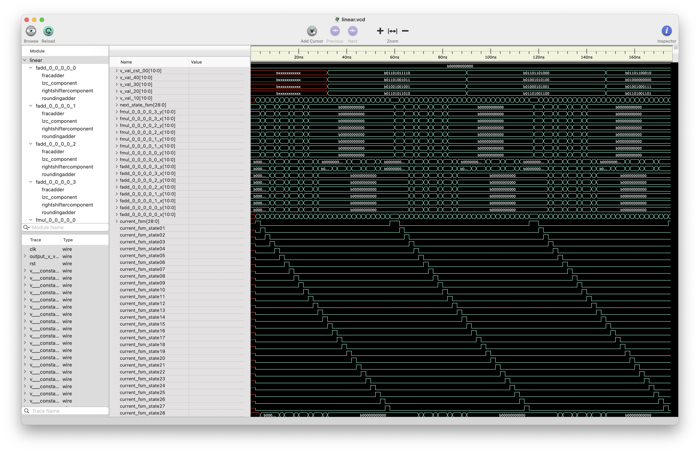

# BraggHLS

- [BraggHLS](#bragghls)
- [TL;DR](#tl-dr)
- [Repo structure](#repo-structure)
- [Current status](#current-status)
- [Docker](#docker)
- [Building](#building)
  * [Requirements](#requirements)
  * [Build steps](#build-steps)
- [Running](#running)

This a framework for lowering PyTorch models to RTL using high-level synthesis (HLS) techniques.
Crucially, we do **not** use any existing HLS tools (such as Xilinx's Vitis).
In addition, there are no fixed architecture designs (with the exception of [FloPoCo's](http://flopoco.org/) floating
point IPs) - no systolic arrays, no matrix multipliers - i.e., models are actually compiled.
The particular, driving, use case is low-latency [Bragg peak detection](https://arxiv.org/abs/2008.08198) for
high-energy diffraction microscopy (HEDM).

The "flow" is

<p align="center">
  
</p>

# TL;DR

Turn this

```python
class DoubleCNN(nn.Module):
    def __init__(self, scale):
        super().__init__()
        self.conv1 = torch.nn.Conv2d(1, 16 * scale, 3)
        self.conv2_1 = torch.nn.Conv2d(16 * scale, 8 * scale, 1)
        self.conv2_2 = torch.nn.Conv2d(16 * scale, 8 * scale, 1)
        self.conv2_3 = torch.nn.Conv2d(16 * scale, 8 * scale, 1)
        self.conv3 = torch.nn.Conv2d(8 * scale, 16 * scale, 1)
        self.conv4 = torch.nn.Conv2d(16 * scale, 8 * scale, 3)

    def forward(self, x):
        y = self.conv1(x)
        z = self.conv2_1(y)
        w = self.conv2_2(y)
        u = self.conv2_3(y)
        uuu = z + w + u
        uu = self.conv3(uuu)
        return uu.sum()
```

into this

```mlir
#map = affine_map<(d0, d1) -> (d0 + d1)>
module attributes {torch.debug_module_name = "DoubleCNN"} {
  memref.global "private" constant @__constant_16x1x3x3xf32 : memref<16x1x3x3xf32> = dense<"...">
  memref.global "private" constant @__constant_16xf32_0 : memref<16xf32> = dense<[0.243066281, 0.331322402, ...]>
  memref.global "private" constant @__constant_8x16x1x1xf32_1 : memref<8x16x1x1xf32> = dense<"...">
  memref.global "private" constant @__constant_8xf32_1 : memref<8xf32> = dense<[0.0737214088, 0.0993697941, ...]>
  memref.global "private" constant @__constant_8x16x1x1xf32_0 : memref<8x16x1x1xf32> = dense<"...">
  memref.global "private" constant @__constant_8xf32_0 : memref<8xf32> = dense<[0.0834305584, -0.150565714, ...]>
  memref.global "private" constant @__constant_8x16x1x1xf32 : memref<8x16x1x1xf32> = dense<"...">
  memref.global "private" constant @__constant_8xf32 : memref<8xf32> = dense<[-0.0900013148, -0.189049691,...]>
  memref.global "private" constant @__constant_16x8x1x1xf32 : memref<16x8x1x1xf32> = dense<"...">
  memref.global "private" constant @__constant_16xf32 : memref<16xf32> = dense<[-0.133005634, -0.297289908, ...]>
  func.func @forward(%arg0: memref<1x1x11x11xf32>) -> memref<f32> {
    %11 = memref.alloca() : memref<1x16x9x9xf32>
    memref.copy %10, %11 : memref<1x16x9x9xf32> to memref<1x16x9x9xf32>
    scf.parallel (%arg1, %arg2, %arg3, %arg4) = (%c0, %c0, %c0, %c0) to (%c1, %c16, %c9, %c9) step (%c1, %c1, %c1, %c1) {
      scf.for %arg5 = %c0 to %c1 step %c1 {
        scf.for %arg6 = %c0 to %c3 step %c1 {
          scf.for %arg7 = %c0 to %c3 step %c1 {
            %24 = affine.apply #map(%arg3, %arg6)
            %25 = affine.apply #map(%arg4, %arg7)
            %26 = memref.load %arg0[%arg1, %arg5, %24, %25] : memref<1x1x11x11xf32>
            %27 = memref.load %9[%arg2, %arg5, %arg6, %arg7] : memref<16x1x3x3xf32>
            %28 = memref.load %11[%arg1, %arg2, %arg3, %arg4] : memref<1x16x9x9xf32>
            %29 = arith.mulf %26, %27 : f32
            %30 = arith.addf %28, %29 : f32
            memref.store %30, %11[%arg1, %arg2, %arg3, %arg4] : memref<1x16x9x9xf32>
          }
        }
      }
      scf.yield
    }
    
    ...
      
    }
    %22 = memref.alloca() : memref<f32>
    memref.store %cst, %22[] : memref<f32>
    %23 = memref.alloc() {alignment = 128 : i64} : memref<f32>
    memref.copy %22, %23 : memref<f32> to memref<f32>
    scf.for %arg1 = %c0 to %c1 step %c1 {
      scf.for %arg2 = %c0 to %c16 step %c1 {
        scf.for %arg3 = %c0 to %c9 step %c1 {
          scf.for %arg4 = %c0 to %c9 step %c1 {
            %24 = memref.load %21[%arg1, %arg2, %arg3, %arg4] : memref<1x16x9x9xf32>
            %25 = memref.load %23[] : memref<f32>
            %26 = arith.addf %24, %25 : f32
            memref.store %26, %23[] : memref<f32>
          }
        }
      }
    }
    return %23 : memref<f32>
  }
}

```

into this

<p align="center">
  
</p>
<p align="center">
  (Red represents FMUL logic, green represents FADD logic, on Xilinx Alveo U280)
</p>

<!---

[//]: # (![alt text]&#40;docs/images/double_cnn.png&#41;)
[//]: # (3:#highlight_objects -color green -leaf_cells [get_cells _forward_inner/fadd*]
[//]: # (54:#highlight_objects -color red -leaf_cells [get_cells _forward_inner/fmul*])
--->

# Repo structure

This project has a lot of moving parts; the directory structure tells the tale:

- [bragghls/](bragghls) - the core python library
    - [compiler/compiler.py](bragghls/compiler.py) - python script the drives the entire flow
    - [flopoco/](bragghls/flopoco) - functionality related to converting between [FloPoCo's](http://flopoco.org/)
      nonstandard floating point representation and IEEE754 (for purposes of RTL generation *and* simulation)
    - [ip_cores/](bragghls/ip_cores) - FloPoCo cores for 4,4 and 5,5 floating point addition and multiplication along with testbench
      generation
    - [ir/](bragghls/ir) - functionality related to parsing, transforming, and interpreting MLIR representations of
      PyTorch models.
    - [rtl/](bragghls/rtl) - functionality related to emitting RTL (SystemVerilog)
    - [testbench/](bragghls/testbench) - testbench runners via [cocotb](https://www.cocotb.org/)
      and [iverilog](http://iverilog.icarus.com/)
- [bragghls_translate/](bragghls_translate) - MLIR parser/emitter translation library for translating MLIR to python
- [examples/](examples) - obviously...
- [extensions/flopoco_convert_ext/](extensions/flopoco_convert_ext) - pybind-ed extension for converting between IEEE754 and
  FloPoCo's floating point representation
- [scripts/](scripts) - helper scripts for things like generating new FloPoCo IPs and building the entire project
- [tests/](tests) - obviously...

# Current status

[](https://github.com/makslevental/bragghls/actions/workflows/build_and_test.yml)
[](https://github.com/makslevental/bragghls/actions/workflows/build_docker.yml)

[//]: # ([![Build Docker]&#40;https://github.com/makslevental/bragghls/actions/workflows/build_docker.yml/badge.svg&#41;]&#40;https://github.com/makslevental/bragghls/actions/workflows/build_docker.yml&#41;)

[//]: # ([linear]&#40;examples/linear.py&#41; and [cnn]&#40;examples/cnn.py&#41; examples work &#40;including tiling&#41;)

[//]: # (but [braggnn]&#40;examples/braggnn.py&#41; still needs adjustment &#40;compiles but doesn't pass tests&#41;.)

# Docker

The easiest way to get started is to build a docker container using the [Dockerfile](Dockerfile):

```shell
docker build . -t bragghls && docker run -it bragghls
```

or just pull the latest image from dockerhub:

```shell
docker pull mlevental/bragghls:latest && docker run -it mlevental/bragghls
```

# Building

The build steps are many and tortuous.

## Requirements

1. A compiler (GCC or Clang)
2. Python (>= 3.10) (recommended to use conda)
3. [GNU MP Bignum Library](https://gmplib.org/)
4. [GNU Multiple Precision Floating-Point Reliable Library](https://www.mpfr.org/)
5. [Multiple Precision Floating-point Interval library](http://perso.ens-lyon.fr/nathalie.revol/software.html)
6. [Icarus Verilog](http://iverilog.icarus.com/) (`sudo apt-get install iverilog`)
7. Patience

On Linux you can `bash -c "$(wget -O - https://apt.llvm.org/llvm.sh)"` for Clang and

```shell
sudo apt-get install libgmp3-dev libmpfr-dev libmpfi-dev iverilog
```

On Mac you can

```shell
brew install llvm gmp mpfr mpfi icarus-verilog
```

## Build steps

1. First make sure you have all the submodules checked out by running [scripts/clone_externals.sh](scripts/clone_externals.sh); This
   will take a while due to our dependency on LLVM.
2. `pip install -r requirements.txt` to get PyTorch and TorchMLIR; if this fails due to unsupported platform for
   TorchMLIR it's probably because wheels are broken (cf. [releases](https://github.com/llvm/torch-mlir/releases)).
   Consult [scripts/build.sh](scripts/build.sh) for how to build TorchMLIR from source, or feel free to reach out to me.
3. `pip install . -vvvv`. This will:
    1. Build all of LLVM
    2. Build CIRCT against LLVM
    3. Build `bragghls_translate` and `flopoco_converter`
    4. Put all of the things in the correct places (`circt-opt` and `bragghls_translate` in `venv/bin`)

If you get some mysterious errors like

```shell
The C++ compiler "/usr/bin/c++" is not able to compile a simple test program
```

make sure you have either GCC or Clang in your path but also set the `C_COMPILER`, `CXX_COMPILER` environment variables like this:

```shell
C_COMPILER=clang CXX_COMPILER=clang++ pip install . -vvvv
```

# Running

There is a small config file that sets necessary parameters (cf. [bragghls_config.ini](bragghls_config.ini)).
The path to this config file needs to be set as an environment variable before invoking any of the bragghls scripts, as such:

```shell
BRAGGHLS_CONFIG_FP=$(pwd)/bragghls_config.ini bragghls_compiler 
```

Note the `$(pwd)` which is necessary if you're running the testbenches.

Assuming everything built successfully and you have all of the correct paths and environment variables, run any of the
scripts in [examples](examples) to generate MLIR IR. 
Then the main [compiler driver](bragghls/compiler/compile.py) can be run with the following arguments

```shell
usage: BraggHLS compiler driver [-h] [-t] [-r] [-s] [-v] [-b] [-n N_TEST_VECTORS] [--threshold THRESHOLD] fp

positional arguments:
  fp                    Filepath of top-level MLIR file

options:
  -h, --help            show this help message and exit
  -t, --translate       Translate MLIR to python
  -r, --rewrite         Transform/rewrite python
  -s, --schedule        Schedule the model using CIRCT
  -v, --verilog         Emit verilog
  -b, --testbench       Run autogenerated testbench
  -n N_TEST_VECTORS, --n_test_vectors N_TEST_VECTORS
                        Number of test vectors for testbench
  --threshold THRESHOLD
                        Test for average number of testbench failures instead of absolute
```

For example,

```shell
BRAGGHLS_CONFIG_FP=$(pwd)/bragghls_config.ini python $(pwd)/examples/simple_nns.py linear --size 11
```

which runs [examples/simple_nns.py](examples/simple_nns.py) and produces an artifacts folder
at [examples/linear_bragghls_artifacts](examples/linear_bragghls_artifacts) which will contains a `linear.mlir` file
that looks like

```mlir
module attributes {torch.debug_module_name = "Linear"} {
  memref.global "private" constant @__constant_8x8xf32 : memref<8x8xf32> = dense<[...]>
  memref.global "private" constant @__constant_8xf32 : memref<8xf32> = dense<[...]>
  func.func @forward(%arg0: memref<1x8xf32>) -> memref<f32> {
    
    ...
    
    scf.for %arg1 = %c0 to %c1 step %c1 {
      scf.for %arg2 = %c0 to %c8 step %c1 {
        %7 = memref.load %4[%arg1, %arg2] : memref<1x8xf32>
        %8 = memref.load %6[] : memref<f32>
        %9 = arith.addf %7, %8 : f32
        memref.store %9, %6[] : memref<f32>
      }
    }
    return %6 : memref<f32>
  }
}
```

Then running

```shell
BRAGGHLS_CONFIG_FP=$(pwd)/bragghls_config.ini bragghls_compiler $(pwd)/examples/linear_bragghls_artifacts/linear.mlir -t -r -s -v -b
```

will generate `linear.sv` and run the automatically generated (no artifact) testbench, and produce the following output:

```
INFO: Running command: iverilog "-o "examples/linear_bragghls_artifacts/sim.vvp "-D "COCOTB_SIM=1 "-g2012 ...
     0.00ns INFO     Running on Icarus Verilog version 11.0 (stable)
     0.00ns INFO     Running tests with cocotb v1.6.2 from ...
     0.00ns INFO     Seeding Python random module with 1659448436
     0.00ns WARNING  Pytest not found, assertion rewriting will not occur
     0.00ns INFO     Found test tb_runner.test_tb
     0.00ns INFO     running test_tb (1/1)
     
outputs {'_6': [<IEEE -4.6549486522000025> <FPNumber -4.50e0:01110010010>]}
passed 43
outputs {'_6': [<IEEE -1.2715176573999998> <FPNumber -1.31e0:01101110101>]}
passed 87
outputs {'_6': [<IEEE -7.192521898300005> <FPNumber -6.75e0:01110011011>]}
passed 131
outputs {'_6': [<IEEE -0.42565990870000003> <FPNumber -5.00e-1:01101100000>]}
passed 175

...

passed 703
outputs {'_6': [<IEEE 5.495344332200002> <FPNumber 5.00e0:01010010100>]}
passed 747
outputs {'_6': [<IEEE 4.6494865835> <FPNumber 5.25e0:01010010101>]}
passed 791
outputs {'_6': [<IEEE -2.963233154800001> <FPNumber -3.12e0:01110001001>]}
passed 835
outputs {'_6': [<IEEE 3.8036288347999996> <FPNumber 4.00e0:01010010000>]}
passed 879


  1761.00ns INFO     test_tb passed
  1761.00ns INFO     **************************************************************************************
                     ** TEST                          STATUS  SIM TIME (ns)  REAL TIME (s)  RATIO (ns/s) **
                     **************************************************************************************
                     ** tb_runner.test_tb              PASS        1761.00           1.08       1636.30  **
                     **************************************************************************************
                     ** TESTS=1 PASS=1 FAIL=0 SKIP=0               1761.00           1.12       1571.26  **
                     **************************************************************************************
```

If you have a waveform viewer ([gtkwave](http://gtkwave.sourceforge.net/)
or [Scansion](http://www.logicpoet.com/scansion/)), then you can examine the generated `linear.vcd`:


